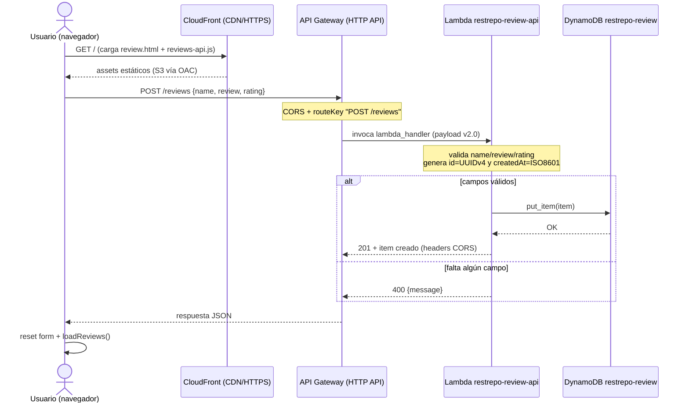
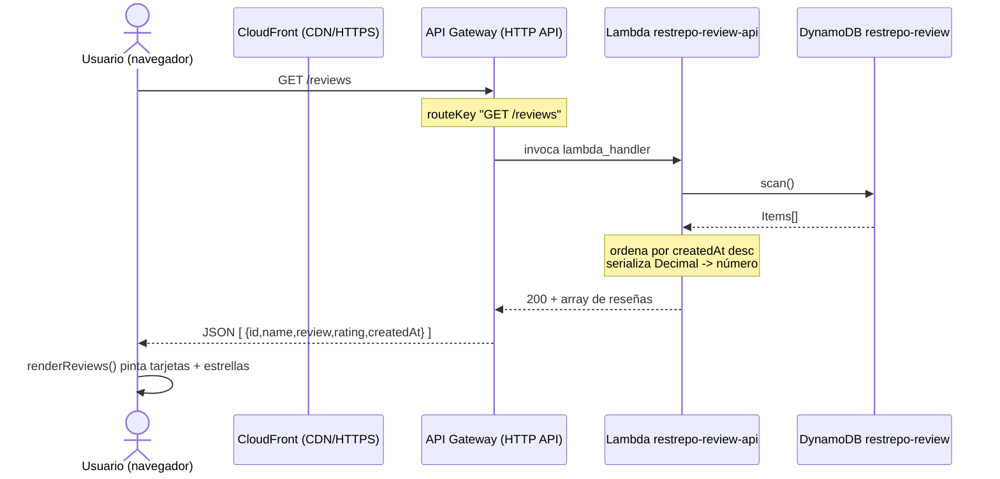
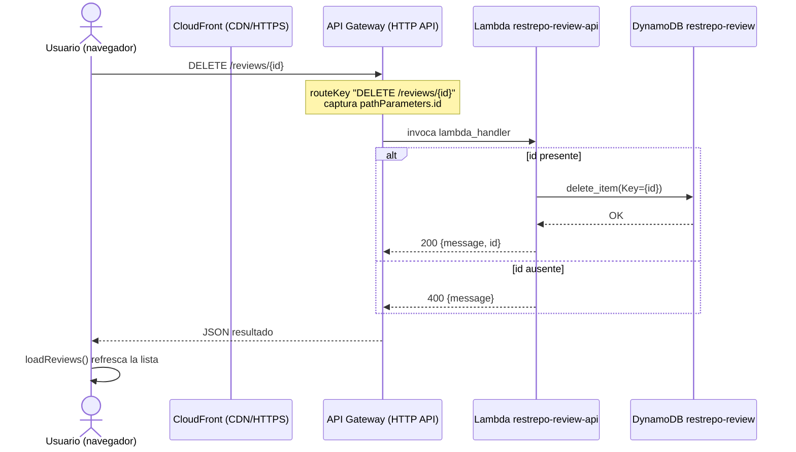

# Documento Funcional de Definición — Rick and Morty Store

| | |
|---|---|
| **Materia** | Arquitectura de Sistemas en la Nube con AWS (IFTS 16) |
| **Trabajo** | Trabajo Práctico Final |
| **Alumno** | Emanuel Restrepo |
| **Modalidad** | Individual |
| **Arquitectura** | Serverless — Opción C |
| **URL pública** | https://d2mb47m6hnir3o.cloudfront.net |
| **Región AWS** | us-east-1 |
| **Cuenta** | IFTS (compartida) — 462525374800 |
| **Prefijo de recursos** | `restrepo-` |
| **Fecha** | Junio 2026 |

---

## Tabla de contenidos

1. [Objetivo y alcance del documento](#1-objetivo-y-alcance-del-documento)
   - 1.1. [Propósito](#11-proposito)
   - 1.2. [A quién está dirigido](#12-a-quien-esta-dirigido)
   - 1.3. [Qué cubre este documento](#13-que-cubre-este-documento)
   - 1.4. [Qué NO cubre (fuera de alcance)](#14-que-no-cubre-fuera-de-alcance)
2. [Mapeo con la premisa de la cátedra](#2-mapeo-con-la-premisa-de-la-catedra)
3. [Glosario de servicios AWS utilizados](#3-glosario-de-servicios-aws-utilizados)
   - 3.1. [Amazon S3 (Simple Storage Service)](#31-amazon-s3-simple-storage-service)
   - 3.2. [Amazon CloudFront](#32-amazon-cloudfront)
   - 3.3. [OAC (Origin Access Control)](#33-oac-origin-access-control)
   - 3.4. [Amazon API Gateway (HTTP API)](#34-amazon-api-gateway-http-api)
   - 3.5. [AWS Lambda](#35-aws-lambda)
   - 3.6. [Amazon DynamoDB](#36-amazon-dynamodb)
   - 3.7. [AWS IAM (Identity and Access Management)](#37-aws-iam-identity-and-access-management)
4. [Justificación de la arquitectura serverless (Opción C)](#4-justificacion-de-la-arquitectura-serverless-opcion-c)
5. [Descripción de la infraestructura paso a paso](#5-descripcion-de-la-infraestructura-paso-a-paso)
   - 5.1. [Amazon S3 — Bucket privado `restrepo-ecommerce-frontend`](#51-amazon-s3--bucket-privado-restrepo-ecommerce-frontend)
   - 5.2. [Amazon CloudFront + OAC — Distribución `E1XU4VXVD4GQM6`](#52-amazon-cloudfront--oac--distribucion-e1xu4vxvd4gqm6)
   - 5.3. [Amazon API Gateway (HTTP API) — `restrepo-reviews-api`](#53-amazon-api-gateway-http-api--restrepo-reviews-api)
   - 5.4. [AWS Lambda — `restrepo-review-api`](#54-aws-lambda--restrepo-review-api)
   - 5.5. [Amazon DynamoDB — Tabla `restrepo-review`](#55-amazon-dynamodb--tabla-restrepo-review)
   - 5.6. [AWS IAM — Rol de ejecución `lab-lambda-exec`](#56-aws-iam--rol-de-ejecucion-lab-lambda-exec)
6. [Flujo de datos extremo a extremo](#6-flujo-de-datos-extremo-a-extremo)
7. [Actores](#7-actores)
8. [Casos de uso](#8-casos-de-uso)
   - 8.1. [UC-01 — Crear reseña](#81-uc-01--crear-resena)
   - 8.2. [UC-02 — Listar reseñas](#82-uc-02--listar-resenas)
   - 8.3. [UC-03 — Eliminar reseña](#83-uc-03--eliminar-resena)
9. [Requisitos funcionales](#9-requisitos-funcionales)
10. [Requisitos no funcionales](#10-requisitos-no-funcionales)
11. [Reglas de negocio](#11-reglas-de-negocio)
12. [Modelo de datos](#12-modelo-de-datos)
13. [Especificación BDD (Gherkin)](#13-especificacion-bdd-gherkin)
14. [Diagramas de secuencia](#14-diagramas-de-secuencia)
15. [Matriz de trazabilidad](#15-matriz-de-trazabilidad)
16. [Seguridad y buenas prácticas](#16-seguridad-y-buenas-practicas)
17. [Cumplimiento de la rúbrica](#17-cumplimiento-de-la-rubrica)
18. [Conclusiones](#18-conclusiones)
19. [Anexo — Archivos del repositorio que fundamentan el documento](#19-anexo--archivos-del-repositorio-que-fundamentan-el-documento)
20. [Anexo B — Feature client-side: contador dinámico de carrito](#20-anexo-b--feature-client-side-contador-dinamico-de-carrito)

---

## 1. Objetivo y alcance del documento

Este documento es la **especificación funcional y técnica** del proyecto *Rick and Morty Store*, desarrollado como Trabajo Práctico Final de la materia "Arquitectura de Sistemas en la Nube con AWS" (IFTS 16).

### 1.1. Propósito

El propósito del documento es doble:

- **Funcional**: describir *qué hace* el sistema desde la perspectiva del usuario (publicar, listar y eliminar reseñas de productos) y *por qué* cada decisión de negocio se resolvió de la forma en que se resolvió.
- **Técnico**: documentar *cómo* está construido y desplegado en AWS, justificando la elección de cada servicio y el flujo de datos extremo a extremo, de modo que la solución sea reproducible, defendible oralmente y evaluable contra la rúbrica de la cátedra.

### 1.2. A quién está dirigido

El lector primario es el tribunal evaluador de la materia. El registro es académico y didáctico de forma intencional: se asume que el evaluador conoce los conceptos de arquitectura, pero el documento explica cada servicio de AWS desde cero para que también sea comprensible por un lector sin experiencia previa en la nube. Sirve, además, como guion de apoyo para la defensa oral con demo en vivo.

### 1.3. Qué cubre este documento

- Marco conceptual y glosario de los servicios AWS empleados.
- Justificación de la arquitectura serverless elegida (Opción C).
- Diseño de la solución, contrato de la API, modelo de datos y flujo de una petición.
- Buenas prácticas aplicadas (bucket privado, ausencia de credenciales, nomenclatura, mínimo privilegio).
- Estrategia de QA y resultados de la suite automatizada.

### 1.4. Qué NO cubre (fuera de alcance)

- **Autenticación/autorización de usuarios finales**: la aplicación es pública y sin login, por decisión de alcance del TP.
- **Pasarelas de pago, *checkout* transaccional o gestión de inventario real**: el componente con backend es el módulo de reseñas (CRUD), que es el que satisface el requisito de funcionalidad de la consigna. *Sí* se incluye un **carrito de compras del lado del cliente** (en `localStorage`) con un **contador dinámico** en el navbar como mejora de UX (ver Anexo B, capítulo 20); este carrito no persiste en DynamoDB ni procesa pagos.
- **Infraestructura como código (Terraform/CloudFormation), pipelines de CI/CD y observabilidad avanzada**: el aprovisionamiento se hizo manualmente desde la consola, acorde a los labs de la cursada.
- **Estimación detallada de costos productivos a escala**: se trabaja sobre la cuenta compartida del instituto en modo on-demand.

---

## 2. Mapeo con la premisa de la cátedra

La siguiente tabla traza cada requisito obligatorio de la consigna contra la evidencia concreta de este proyecto. Es la base de la trazabilidad consigna → solución que se defenderá oralmente.

| # | Requisito obligatorio de la consigna | Cómo lo satisface este proyecto |
|---|--------------------------------------|---------------------------------|
| 1 | Sistema desplegado en AWS y accesible por URL pública | Frontend servido por CloudFront sobre HTTPS en `https://d2mb47m6hnir3o.cloudfront.net`, accesible desde cualquier navegador sin instalación. |
| 2 | Funcionalidad real con CRUD mínimo (crear, listar, eliminar) | Módulo de reseñas operativo: **POST /reviews** (crear), **GET /reviews** (listar), **DELETE /reviews/{id}** (eliminar), resuelto por una Lambda que enruta por `routeKey`. |
| 3 | Persistencia en DynamoDB | Tabla `restrepo-review` (partition key `id`, capacidad on-demand). Cada reseña persiste como ítem `{id, name, review, rating, createdAt}`; la Lambda opera con `boto3` (`scan`, `put_item`, `delete_item`). |
| 4 | Usar al menos una de las 3 arquitecturas propuestas | Se implementó la **Opción C — Serverless** (S3 + CloudFront + API Gateway HTTP API + Lambda + DynamoDB). |
| 5 | Diagrama de arquitectura + documento técnico | Diagrama de componentes y flujo (capítulos 5 y 6), diagramas de secuencia (capítulo 14) y este documento técnico-funcional. |
| 6 | Defensa oral con demo en vivo | La URL pública permite demostrar el CRUD en vivo; este documento funciona como guion de la defensa. |
| BP-1 | Bucket privado si se usa CloudFront | Bucket `restrepo-ecommerce-frontend` con **Block Public Access activado**; CloudFront accede vía **OAC**. No hay acceso directo al bucket por URL. |
| BP-2 | Sin credenciales en el código | La Lambda asume el rol IAM `lab-lambda-exec`; no hay Access Keys ni secretos en el repositorio. El frontend solo conoce la URL pública de la API. |
| BP-3 | Nombres claros de recursos | Todos los recursos usan el prefijo `restrepo-` (ej. `restrepo-reviews-api`, `restrepo-review`), lo que evita colisiones en la cuenta compartida del instituto. |
| BP-4 | Security Groups acotados | **No aplica** en serverless: no se administran instancias ni redes. La superficie de exposición se controla por IAM (mínimo privilegio) y CORS, no por SG. |

---

## 3. Glosario de servicios AWS utilizados

Antes de explicar cómo se usó cada servicio en el resto del documento, esta sección define **qué es** cada uno y **qué problema resuelve**. La lógica de fondo es siempre la misma: AWS ofrece servicios *gestionados* que evitan tener que montar y mantener servidores propios.

### 3.1. Amazon S3 (Simple Storage Service)

**Qué es.** Un servicio de almacenamiento de **objetos** (archivos) en la nube, organizados en contenedores llamados *buckets*. Cada archivo se guarda como un objeto con un identificador único.

**Qué problema resuelve.** Guardar archivos de forma duradera, barata y prácticamente ilimitada sin administrar discos ni servidores de archivos. En este proyecto cumple el rol de *hosting* del frontend estático (HTML, CSS, JS): es el lugar físico donde viven los archivos del sitio.

### 3.2. Amazon CloudFront

**Qué es.** Una **CDN** (Content Delivery Network): una red de servidores distribuidos geográficamente que cachean y entregan contenido cerca del usuario final.

**Qué problema resuelve.** Tres cosas a la vez: (1) **velocidad**, al servir el contenido desde el punto de presencia más cercano; (2) **HTTPS**, aportando certificado y cifrado sin configurar un servidor web; y (3) **seguridad de origen**, permitiendo que el bucket S3 permanezca privado y solo CloudFront pueda leerlo. Es la **puerta de entrada pública** del sistema.

### 3.3. OAC (Origin Access Control)

**Qué es.** Un mecanismo de CloudFront que firma las peticiones hacia el bucket S3, de modo que **solo la distribución de CloudFront** está autorizada a leer los objetos.

**Qué problema resuelve.** Permite mantener el bucket completamente privado (Block Public Access activado) sin renunciar a publicar el sitio. Sin OAC, para servir desde S3 habría que abrir el bucket al público, lo que viola una buena práctica explícita de la consigna. OAC es la pieza que concilia "sitio público" con "bucket privado".

### 3.4. Amazon API Gateway (HTTP API)

**Qué es.** Un servicio gestionado que expone **endpoints HTTP** públicos y los conecta con un backend (en este caso, una Lambda). Recibe la petición del navegador y la enruta hacia la función correspondiente.

**Qué problema resuelve.** Provee la "fachada" de la API (URL pública, ruteo, CORS, manejo de métodos) sin tener que programar ni mantener un servidor web que escuche peticiones. La variante **HTTP API** se eligió por ser más simple y económica que la REST API clásica, suficiente para un CRUD. Aquí define las rutas `GET /reviews`, `POST /reviews` y `DELETE /reviews/{id}` y habilita CORS para que el frontend pueda invocarla desde el navegador.

### 3.5. AWS Lambda

**Qué es.** Un servicio de cómputo **serverless**: ejecuta código bajo demanda, en respuesta a un evento (aquí, una petición de API Gateway), sin que exista un servidor encendido de forma permanente.

**Qué problema resuelve.** Elimina la administración de servidores: no hay sistema operativo que parchear, ni instancias que escalar manualmente. Se paga solo por el tiempo de ejecución. En este proyecto, **una única función** (`restrepo-review-api`, Python 3.13, ARM64) contiene toda la lógica de negocio: enruta por el `routeKey`, valida los datos, genera el `id` UUID y opera DynamoDB con `boto3`. Es el "cerebro" del backend.

### 3.6. Amazon DynamoDB

**Qué es.** Una base de datos **NoSQL** gestionada de tipo clave-valor/documento, totalmente administrada por AWS.

**Qué problema resuelve.** Persistir datos de forma duradera y escalable sin administrar un motor de base de datos. Su modo **on-demand** ajusta capacidad automáticamente y se paga por uso, ideal para una carga impredecible y baja como la de un TP. Encaja naturalmente con Lambda porque ambos son servicios gestionados que escalan solos. Almacena las reseñas, cada una identificada por su `id` (UUID) como clave de partición.

### 3.7. AWS IAM (Identity and Access Management)

**Qué es.** El servicio que gobierna **quién puede hacer qué** dentro de AWS, mediante usuarios, roles y políticas de permisos.

**Qué problema resuelve.** Aplicar el principio de **mínimo privilegio** y, sobre todo, eliminar credenciales del código. En lugar de incrustar Access Keys, la Lambda **asume un rol** (`lab-lambda-exec`) que le otorga exactamente los permisos de DynamoDB que necesita. AWS inyecta credenciales temporales en tiempo de ejecución; el código nunca las ve ni las almacena. Es la pieza que materializa la buena práctica "sin credenciales en el código".

---

## 4. Justificación de la arquitectura serverless (Opción C)

La consigna ofrecía tres caminos arquitectónicos. Se eligió la **Opción C (Serverless)** sobre las alternativas basadas en EC2 (servidor virtual) o Docker (contenedores). La decisión no es estética: responde a la lógica del problema, al perfil de la aplicación y a la correspondencia con lo practicado en clase.

| Criterio | Serverless (Opción C) — elegida | EC2 / Docker — descartadas |
|----------|----------------------------------|----------------------------|
| Administración de servidores | Nula: AWS gestiona SO, parches y disponibilidad | Hay que aprovisionar, parchear y monitorear instancias |
| Escalado | Automático y por petición (Lambda + DynamoDB on-demand) | Manual o vía Auto Scaling configurado a mano |
| Costo en reposo | ~Cero: se paga solo por uso real | La instancia corre (y se factura) aunque nadie la use |
| Superficie de seguridad | Sin SG ni puertos abiertos; control por IAM + CORS | Requiere Security Groups, gestión de puertos y hardening |
| Esfuerzo operativo del alumno | Bajo: foco en el código de negocio | Alto: foco también en infraestructura |

Las razones concretas de la elección:

1. **Reutilización del frontend estático.** El sitio ya era HTML/CSS/JS puro. Un frontend estático no necesita un servidor de aplicaciones encendido; le basta un *hosting* de archivos (S3) detrás de una CDN (CloudFront). Montar un EC2 para servir archivos estáticos sería sobredimensionar la solución.

2. **No administrar servidores.** El objetivo del TP es demostrar una arquitectura en la nube funcional, no operar infraestructura. Serverless traslada a AWS la responsabilidad de SO, parches, disponibilidad y escalado, dejando al alumno concentrado en la **lógica de negocio** (la función Lambda y el modelo de datos).

3. **Costo coherente con el contexto.** Sobre la cuenta compartida del instituto y con tráfico mínimo e intermitente, el modelo "pago por uso" de Lambda + DynamoDB on-demand tiende a costo casi nulo en reposo. Un EC2 facturaría de forma continua aunque la aplicación no reciba visitas, lo cual es ineficiente para un proyecto académico.

4. **Menor superficie de ataque y buenas prácticas "por diseño".** Al no haber instancias, **no hay Security Groups ni puertos que exponer** (de ahí que ese requisito no aplique). El acceso se controla con IAM (mínimo privilegio mediante el rol `lab-lambda-exec`) y con CORS en API Gateway. El bucket queda privado gracias a OAC. Varias buenas prácticas exigidas se obtienen como consecuencia natural del modelo serverless, no como un agregado.

5. **Correspondencia con los labs de la cursada.** Los servicios empleados (S3, CloudFront, API Gateway, Lambda, DynamoDB, IAM) son exactamente los trabajados en los laboratorios de la materia. Elegir esta arquitectura permite reutilizar el conocimiento adquirido y defender cada componente con respaldo práctico, en lugar de introducir tecnologías no vistas en clase.

**Conclusión de la decisión.** Para una aplicación de frontend estático con un backend de CRUD ligero, sin estado de servidor y con tráfico bajo e impredecible, el serverless ofrece la mejor relación entre simplicidad, costo, seguridad y alineación pedagógica. EC2 o Docker habrían añadido complejidad operativa sin aportar valor funcional al alcance definido.

---

## 5. Descripción de la infraestructura paso a paso

Esta sección recorre la arquitectura serverless **componente por componente, en el mismo orden en que viaja una petición real**: desde el navegador del usuario hasta la base de datos y de vuelta. Para cada componente se explica *qué hace*, *para qué sirve* (qué problema resuelve en este sistema concreto), *la lógica detrás de su configuración* (qué se decidió y por qué) y *cómo se enlaza con el siguiente eslabón*. El hilo conductor es siempre el mismo: ningún componente está elegido "porque sí", sino para cumplir un requisito de la consigna o una buena práctica exigida por la rúbrica.

El flujo lógico es:

```
Navegador → CloudFront (HTTPS/CDN) ──OAC──> S3 (frontend privado)
                                  │
        El JS descargado llama por fetch a ↓
                          API Gateway (HTTP API) → Lambda (Python) → DynamoDB
                                                        ▲
                                                  rol IAM lab-lambda-exec
```

### 5.1. Amazon S3 — Bucket privado `restrepo-ecommerce-frontend`

**Qué hace en este sistema.** Es el *almacén* de los archivos estáticos del frontend: `index.html`, `review.html`, las hojas de estilo, y los scripts `config.js` y `reviews-api.js`. No ejecuta lógica; solo guarda y entrega objetos cuando alguien autorizado se los pide.

**Para qué sirve / qué problema resuelve.** Una tienda como "Rick and Morty Store" no necesita un servidor web encendido las 24 horas para servir HTML que casi nunca cambia. S3 resuelve el hosting del sitio sin administrar instancias, parches ni sistema operativo: se sube el archivo y queda disponible. Esto materializa el principio serverless de la Opción C (no hay servidores que mantener) y abarata el costo a prácticamente cero cuando no hay tráfico.

**Lógica de configuración (decisiones y porqué).**

| Decisión | Por qué |
|---|---|
| **Block Public Access activado** (bucket totalmente privado) | La buena práctica exigida por la consigna dice textualmente: *"bucket privado si usa CloudFront"*. Si el bucket fuera público, cualquiera podría saltarse el CDN y acceder a los objetos directamente por la URL de S3, perdiendo el control de HTTPS, caché y métricas. Cerrarlo obliga a que **todo** el tráfico pase por CloudFront. |
| **Sin website hosting de S3** | No se usa el modo "static website" de S3 (que requiere lectura pública). En su lugar, CloudFront lee el bucket por la API de S3 mediante OAC. Esto permite mantener el bucket privado y aun así servir el sitio. |
| **Prefijo `restrepo-` en el nombre** | La cuenta es compartida del instituto (IFTS 462525374800). El prefijo evita colisiones de nombres y deja claro qué recursos son del alumno, cumpliendo la buena práctica de "nombres claros". |

**Cómo se conecta con el siguiente.** El bucket **no se expone solo**: su único cliente autorizado es la distribución de CloudFront, que lo accede a través de un OAC (ver 5.2). El navegador del usuario nunca habla con S3 directamente.

### 5.2. Amazon CloudFront + OAC — Distribución `E1XU4VXVD4GQM6`

Dominio: `d2mb47m6hnir3o.cloudfront.net`.

**Qué hace en este sistema.** Es la **puerta de entrada pública del frontend**. Es la URL que se entrega para la defensa (`https://d2mb47m6hnir3o.cloudfront.net`). Recibe la petición del navegador, sirve el HTML/CSS/JS desde su caché (o lo busca en S3 si no lo tiene), y lo devuelve por HTTPS.

**Para qué sirve / qué problema resuelve.** Resuelve tres problemas a la vez:
1. **HTTPS**: S3 con bucket privado no ofrece un endpoint HTTPS amigable para el usuario final; CloudFront aporta el certificado y el cifrado en tránsito.
2. **Cumplir la buena práctica del bucket privado**: es el mecanismo que permite que S3 esté cerrado y el sitio siga siendo accesible.
3. **CDN / rendimiento**: cachea los archivos en *edge locations*, de modo que las recargas no golpean S3 cada vez.

**Lógica de configuración (decisiones y porqué).**

| Decisión | Por qué |
|---|---|
| **OAC (Origin Access Control)** entre CloudFront y S3 | Es el "carnet de identidad" con el que CloudFront se autentica ante el bucket privado. La política del bucket solo confía en *esta* distribución; cualquier otro origen recibe Access Denied. Es el reemplazo moderno y recomendado del antiguo OAI. Sin OAC, mantener el bucket privado sería imposible. |
| **Default Root Object = `index.html`** | Cuando el usuario entra a la raíz (`/`) sin nombrar un archivo, CloudFront sabe que debe servir `index.html` (la home de la tienda). Sin esto, la raíz devolvería un error porque S3 no asume un archivo por defecto. |
| **Redirect HTTP → HTTPS** | Si alguien entra por `http://`, se lo fuerza a `https://`. Garantiza cifrado en tránsito siempre, sin depender de que el usuario escriba el protocolo correcto. |

**Cómo se conecta con el siguiente.** CloudFront sirve los archivos estáticos, **pero no procesa las reseñas**. Cuando el navegador ejecuta el JavaScript descargado (`reviews-api.js`), ese código abre una segunda conexión —independiente de CloudFront— directamente contra la API. Esa URL está fijada en `config.js`:

```js
const API_URL = "https://tvsz0deee9.execute-api.us-east-1.amazonaws.com";
```

Aquí está la separación clave de la arquitectura: **CloudFront/S3 = contenido estático; API Gateway = datos dinámicos**. El frontend descargado actúa de cliente del backend.

### 5.3. Amazon API Gateway (HTTP API) — `restrepo-reviews-api`

Identificador: `tvsz0deee9`. Base: `https://tvsz0deee9.execute-api.us-east-1.amazonaws.com`.

**Qué hace en este sistema.** Es la **puerta de entrada pública del backend**. Expone tres rutas HTTP y, ante cada llamada, invoca la Lambda pasándole un evento que describe la request (método, ruta, body, parámetros).

**Para qué sirve / qué problema resuelve.** Una Lambda por sí sola no tiene una URL HTTP estándar ni gestiona CORS, métodos o rutas. API Gateway pone delante de la función una **capa HTTP administrada**: traduce `GET /reviews` en una invocación de la Lambda y devuelve al navegador la respuesta que la función genera. Es lo que convierte código Python en una API REST consumible desde el navegador.

**Lógica de configuración (decisiones y porqué).**

| Decisión | Por qué |
|---|---|
| **HTTP API (no REST API)** | Para un CRUD simple, el HTTP API es más barato, más rápido de configurar y suficiente. No se necesitan las funciones avanzadas (caché, API keys complejas, transformaciones) del REST API clásico. |
| **Payload v2.0** | Define la *forma* del evento que llega a la Lambda. La función lee `event["routeKey"]`, `event["pathParameters"]` y `event["requestContext"]["http"]["method"]`, que son campos propios de v2.0. El código y la versión del payload deben coincidir; por eso está explícito. |
| **Rutas declaradas:** `GET /reviews`, `POST /reviews`, `DELETE /reviews/{id}` | Mapean exactamente al CRUD mínimo exigido (crear, listar, eliminar). El `{id}` es un parámetro de ruta que API Gateway extrae y entrega en `pathParameters.id`, que la Lambda usa para saber qué reseña borrar. |
| **CORS habilitado** (origin `*`, métodos `GET/POST/DELETE/OPTIONS`, header `content-type`) | El frontend se sirve desde el dominio de **CloudFront**, pero llama a un dominio **distinto** (el de API Gateway). El navegador trata esto como *cross-origin* y, por seguridad, lo bloquea salvo que el servidor lo autorice. CORS es ese permiso. Se incluye `OPTIONS` porque el navegador, antes de un POST/DELETE con `Content-Type: application/json`, envía una petición *preflight* automática para preguntar "¿me dejás?". |

**Contrato de la API.**

| Operación | Método y ruta | Body | Respuesta OK | Errores |
|---|---|---|---|---|
| Listar | `GET /reviews` | — | `200` con array `[ {id,name,review,rating,createdAt} ]` ordenado por `createdAt` desc | — |
| Crear | `POST /reviews` | JSON `{name, review, rating}` | `201` con el ítem creado (`id` UUID generado en la Lambda) | `400` si falta algún campo |
| Eliminar | `DELETE /reviews/{id}` | — | `200` `{message, id}` | — |
| Ruta desconocida | cualquier otra | — | — | `404` |

**Cómo se conecta con el siguiente.** Cada ruta tiene como *integración* la Lambda `restrepo-review-api`. API Gateway no contiene lógica de negocio: arma el evento y lo entrega a la función. La decisión de qué hacer con cada ruta la toma la propia Lambda.

### 5.4. AWS Lambda — `restrepo-review-api`

Handler `lambda_function.lambda_handler`, runtime Python 3.13, arquitectura ARM64.

**Qué hace en este sistema.** Es el **cerebro del backend**: una única función que recibe el evento de API Gateway, decide qué operación es según la ruta, valida los datos, opera sobre DynamoDB con `boto3` y devuelve la respuesta HTTP (código de estado, headers CORS y body JSON).

**Para qué sirve / qué problema resuelve.** Ejecuta la lógica de negocio sin servidor permanente: AWS la enciende solo cuando llega una petición y la apaga después. Resuelve el requisito de *"funcionalidad real (CRUD)"* concentrando las tres operaciones en un solo lugar mantenible.

**Lógica de configuración y de código (decisiones y porqué).**

- **Una sola función que enruta por `routeKey`.** En lugar de tres Lambdas (una por operación), se usa una con un dispatcher interno. El handler lee `event["routeKey"]` y deriva a `list_reviews()`, `create_review()` o `delete_review()`. *Por qué:* para un proyecto académico de este tamaño, una función es más simple de desplegar, versionar y depurar; el costo de mantener tres separadas no se justifica.

  ```python
  if route == "GET /reviews":    return list_reviews()
  if route == "POST /reviews":   return create_review(event)
  if route.startswith("DELETE /reviews"):
      review_id = (event.get("pathParameters") or {}).get("id")
      return delete_review(review_id)
  return response(404, {"message": f"Ruta no encontrada: {route}"})
  ```

- **UUID generado en la Lambda** (`str(uuid.uuid4())`). El identificador de cada reseña lo crea el **backend**, no el cliente. *Por qué:* garantiza unicidad global y evita que un cliente malicioso o con bug envíe un `id` repetido y pise una reseña existente. El `id` es la *partition key* de DynamoDB, así que su unicidad es crítica.

- **Validación de entrada → 400.** Antes de escribir, comprueba que `name`, `review` y `rating` estén presentes; si falta alguno responde `400`. *Por qué:* cumple el contrato de la API (campo faltante = 400) y protege la integridad de la tabla evitando items incompletos. Esto es justamente lo que cubre el caso de QA `TC-API-REVIEWS-06`.

- **`createdAt` en ISO 8601 UTC** (`datetime.now(timezone.utc).isoformat()`). Se guarda la fecha de creación en formato ordenable. *Por qué:* el listado debe devolverse "más nuevas primero", y al ser ISO 8601 una simple ordenación de string ya respeta el orden cronológico.

- **`DecimalEncoder` para serializar.** DynamoDB devuelve los números como objetos `Decimal`, que `json.dumps` no sabe convertir y haría fallar la respuesta. El encoder los transforma a `int` o `float`:

  ```python
  def default(self, o):
      if isinstance(o, Decimal):
          return int(o) if o % 1 == 0 else float(o)
  ```
  *Por qué:* sin esto, todo `GET /reviews` que trajera un `rating` reventaría con un error de serialización. Es el puente entre el tipo de dato de la base y el JSON que espera el navegador.

- **Headers CORS en *todas* las respuestas** y manejo explícito del método `OPTIONS` (preflight) devolviendo 200. *Por qué:* el permiso CORS debe viajar también en las respuestas de la Lambda, no solo en la configuración de API Gateway, para que el navegador acepte la respuesta.

- **`TABLE_NAME` como variable de entorno** (`restrepo-review`). El nombre de la tabla no está hardcodeado en la lógica: se lee de la configuración. *Por qué:* permite cambiar de tabla (p. ej. una de pruebas) sin tocar el código.

- **Runtime Python 3.13 / arquitectura ARM64.** Versión moderna soportada y ARM (Graviton) por mejor relación precio-rendimiento frente a x86. Decisión de eficiencia coherente con el espíritu serverless.

- **Try/except global → 500.** Cualquier error inesperado se captura, se loguea (`print` va a CloudWatch) y se devuelve un `500` controlado en vez de un error crudo. *Por qué:* evita filtrar trazas internas al cliente y deja rastro para depurar.

**Cómo se conecta con el siguiente.** La Lambda no guarda nada en sí misma (es *stateless*): toda la persistencia ocurre en DynamoDB, al que accede mediante el cliente `boto3` (`table.scan()`, `table.put_item()`, `table.delete_item()`). Para tener permiso de hacerlo, asume el rol IAM de ejecución (ver 5.6).

### 5.5. Amazon DynamoDB — Tabla `restrepo-review`

**Qué hace en este sistema.** Es la **base de datos** donde viven las reseñas de forma permanente. Cada reseña es un item con la forma `{ id, name, review, rating, createdAt }`.

**Para qué sirve / qué problema resuelve.** Cumple el requisito explícito de *"persistencia en DynamoDB"*. Es una base NoSQL totalmente administrada (sin servidor que escalar ni parchear), lo que la hace la pareja natural de una arquitectura serverless: la Lambda aparece y desaparece, pero los datos persisten aquí.

**Lógica de configuración (decisiones y porqué).**

| Decisión | Por qué |
|---|---|
| **Partition key `id` (String)** | Cada reseña se identifica y recupera por su UUID. Al ser único, distribuye bien los datos y permite el `delete_item(Key={"id": ...})` exacto que usa la Lambda. |
| **Capacidad On-Demand (pay-per-request)** | No hay que estimar ni provisionar capacidad de lectura/escritura. *Por qué:* el tráfico de un TP académico es esporádico e impredecible; on-demand cobra solo por lo que se usa y escala solo, evitando tanto el sobrecosto de capacidad ociosa como el riesgo de throttling en la demo. |
| **`rating` como Number** | Permite tratar la calificación como número (estrellas 1–5) y es la razón por la que existe el `DecimalEncoder` del lado Lambda. |
| **Listado por `scan` + ordenamiento en la Lambda** | Para un volumen pequeño de reseñas, un `scan` completo es aceptable y simple; el orden "más nuevas primero" se resuelve ordenando por `createdAt` en memoria. *Trade-off declarado:* a gran escala un `scan` no sería eficiente y convendría un índice/GSI, pero para el alcance del proyecto es la opción más simple y mantenible. |

**Cómo se conecta con el siguiente.** DynamoDB es el último eslabón de ida. Su respuesta (los items) sube de vuelta a la Lambda, que la serializa con el `DecimalEncoder` y la devuelve hacia API Gateway y, finalmente, al navegador.

### 5.6. AWS IAM — Rol de ejecución `lab-lambda-exec`

**Qué hace en este sistema.** Es la **identidad con permisos** que la Lambda asume al ejecutarse. Define qué puede hacer la función: en este caso, operar sobre DynamoDB y escribir logs en CloudWatch.

**Para qué sirve / qué problema resuelve.** Resuelve el problema de *cómo autoriza la Lambda sus llamadas a AWS sin guardar contraseñas*. En lugar de poner Access Keys en el código, la función "toma prestada" la identidad del rol, y AWS le entrega credenciales temporales automáticamente por detrás.

**Lógica de configuración (decisiones y porqué).**

- **Rol provisto por la cátedra, con permisos DynamoDB.** Al ser una cuenta compartida del instituto, el rol ya viene definido; la Lambda solo lo referencia como su *execution role*.
- **Sin credenciales en el código.** Esto es directamente verificable revisando `lambda_function.py`: `boto3.resource("dynamodb")` se inicializa **sin** Access Key ni Secret. *Por qué:* cumple la buena práctica exigida *"sin credenciales en el código"* y el estándar de seguridad de no exponer secretos. Las credenciales viajan fuera del código, gestionadas por AWS, y rotan solas.
- **Principio de mínimo privilegio.** El rol concede solo lo necesario (DynamoDB + logs), no permisos amplios sobre toda la cuenta. En serverless, este rol es el equivalente funcional a un Security Group acotado: limita la superficie de lo que la función puede tocar.

**Cómo se conecta con el resto.** El rol es transversal: es lo que *habilita* la conexión Lambda → DynamoDB descrita en 5.4 y 5.5. Sin él, las llamadas `boto3` fallarían con `AccessDenied`.

---

## 6. Flujo de datos extremo a extremo

Para fijar cómo colaboran todos los componentes, se narra el ciclo completo de **crear una reseña** (la operación más representativa, porque atraviesa los seis componentes y escribe en la base):

1. **Carga del sitio.** El usuario abre `https://d2mb47m6hnir3o.cloudfront.net`. **CloudFront** sirve `index.html` (su *default root object*) y, al navegar a la página de reseñas, entrega `review.html` junto con `config.js` y `reviews-api.js`. Si los archivos no están en caché, CloudFront los pide a **S3** autenticándose con el **OAC**; el usuario nunca toca S3 directamente.

2. **El usuario completa el formulario** (nombre, texto, y el rating con el widget de estrellas) y presiona enviar. El JS (`createReview` en `reviews-api.js`) valida que los tres campos estén completos y arma un `POST`:

   ```js
   fetch(`${API_URL}/reviews`, {
     method: "POST",
     headers: { "Content-Type": "application/json" },
     body: JSON.stringify({ name, review, rating }),
   })
   ```

3. **Preflight CORS.** Como es un POST con `Content-Type: application/json` hacia *otro dominio* (el de API Gateway, distinto del de CloudFront), el navegador envía primero una petición `OPTIONS` automática. **API Gateway** la maneja y la respuesta CORS autoriza la llamada real.

4. **La request llega a API Gateway**, que la reconoce como la ruta `POST /reviews`, arma un evento (payload v2.0) e **invoca la Lambda**.

5. **La Lambda procesa.** El handler lee `routeKey == "POST /reviews"` y llama a `create_review(event)`: parsea el body, valida los campos (si faltara alguno cortaría con `400`), genera el `id` con `uuid.uuid4()`, sella `createdAt` en ISO 8601 UTC y convierte `rating` a `Decimal`.

6. **Escritura en DynamoDB.** Mediante `boto3`, ejecuta `table.put_item(Item=...)`. Esta llamada está autorizada porque la función actúa con la identidad del rol **IAM `lab-lambda-exec`**, sin credenciales en el código. La reseña queda persistida en la tabla `restrepo-review`.

7. **Respuesta de vuelta.** La Lambda construye un `201` con el item creado, lo serializa con el `DecimalEncoder` (para que el `rating` Decimal sea JSON válido) y adjunta los headers CORS. Esa respuesta sube por **API Gateway** hasta el navegador.

8. **Refresco de la vista.** El JS recibe el `201`, limpia el formulario y dispara `loadReviews()`, que hace un `GET /reviews`. Ese GET recorre el **mismo camino** (API Gateway → Lambda → `table.scan()` en DynamoDB → ordenado por `createdAt` desc) y devuelve el array completo, donde ahora figura la reseña recién creada, que se pinta en pantalla.

El resultado es el ciclo serverless completo: **contenido estático servido por CloudFront/S3 y datos dinámicos procesados por API Gateway/Lambda/DynamoDB**, con la seguridad sostenida por el bucket privado + OAC en el frontend y por el rol IAM sin credenciales en el backend. Cada pieza cumple un requisito de la consigna y una buena práctica de la rúbrica, y ninguna está de más.

---

## 7. Actores

El sistema distingue dos categorías de actores: el actor humano que interactúa con la aplicación y los servicios de AWS que cumplen un rol activo dentro de los flujos (actores del sistema). Modelar los servicios como actores permite trazar, en cada caso de uso, qué componente ejecuta cada paso y dónde reside la responsabilidad funcional.

| Actor | Tipo | Descripción y responsabilidad |
|-------|------|-------------------------------|
| Usuario / Visitante | Humano (primario) | Persona anónima que accede a la tienda vía navegador. No requiere autenticación. Crea, consulta y elimina reseñas de productos. Es quien dispara todos los casos de uso. |
| Navegador (cliente JS) | Sistema (frontend) | Ejecuta `reviews-api.js` y `review.html`. Renderiza la UI, valida campos en cliente y consume la API REST vía `fetch`. Mediador entre el usuario y el backend. |
| CloudFront + S3 | Sistema (entrega de contenido) | CloudFront sirve por HTTPS el frontend estático alojado en el bucket privado S3 vía OAC. Actor pasivo en el CRUD pero crítico en la entrega inicial de la aplicación. |
| API Gateway | Sistema (puerta de enlace) | Expone las rutas HTTP (`GET/POST/DELETE /reviews`), aplica CORS y enruta cada petición hacia la Lambda. Punto único de entrada al backend. |
| Lambda (`restrepo-review-api`) | Sistema (lógica de negocio) | Enruta por `routeKey`, valida datos, aplica las reglas de negocio, genera el `id` y la fecha, y opera sobre DynamoDB con boto3. Núcleo funcional del sistema. |
| DynamoDB (`restrepo-review`) | Sistema (persistencia) | Almacena los ítems de reseña de forma duradera. Actor final de toda operación de escritura o lectura. |

---

## 8. Casos de uso

Cada caso de uso describe el flujo funcional completo y vincula cada paso con el componente AWS que interviene, para evidenciar cómo la arquitectura serverless satisface el requisito.

### 8.1. UC-01 — Crear reseña

| Campo | Detalle |
|-------|---------|
| **ID** | UC-01 |
| **Nombre** | Crear reseña |
| **Actor** | Usuario / Visitante |
| **Precondiciones** | La aplicación está disponible vía CloudFront. El usuario tiene cargados los campos nombre, texto de reseña y rating en el formulario. |

**Flujo principal:**

1. El usuario completa el formulario (nombre, reseña, rating) en `review.html` — *Navegador*.
2. El usuario presiona "Enviar"; `reviews-api.js` valida en cliente que los campos no estén vacíos — *Navegador*.
3. El cliente ejecuta `POST /reviews` con body JSON `{name, review, rating}` hacia la URL base de la API — *Navegador → API Gateway*.
4. API Gateway valida CORS y enruta la petición (routeKey `POST /reviews`) a la Lambda — *API Gateway*.
5. La Lambda valida la presencia de los tres campos, genera un `id` UUID v4 y un `createdAt` ISO8601 UTC — *Lambda*.
6. La Lambda escribe el ítem `{id, name, review, rating, createdAt}` con boto3 (`put_item`) — *Lambda → DynamoDB*.
7. La Lambda responde `201` con el ítem creado y headers CORS — *Lambda → API Gateway → Navegador*.
8. El cliente confirma la creación y refresca el listado — *Navegador*.

**Flujos alternativos / excepción:**

- **A1 — Campo faltante o vacío:** si en el paso 5 falta `name`, `review` o `rating`, la Lambda responde `400` sin escribir en DynamoDB. El cliente muestra el error y no refresca.
- **A2 — Validación en cliente:** si la validación del paso 2 falla, no se envía la petición; se notifica al usuario localmente (defensa en profundidad, no sustituye la validación del backend).
- **A3 — Error de persistencia:** si `put_item` falla, la Lambda responde con error 5xx y el ítem no se crea.

**Postcondiciones:** existe un nuevo ítem persistido en DynamoDB con `id` único; el listado refleja la nueva reseña.

### 8.2. UC-02 — Listar reseñas

| Campo | Detalle |
|-------|---------|
| **ID** | UC-02 |
| **Nombre** | Listar reseñas |
| **Actor** | Usuario / Visitante |
| **Precondiciones** | La aplicación está disponible vía CloudFront. Puede existir o no contenido previo en la tabla. |

**Flujo principal:**

1. El usuario abre la página de reseñas; `reviews-api.js` se ejecuta al cargar — *Navegador*.
2. El cliente ejecuta `GET /reviews` hacia la API — *Navegador → API Gateway*.
3. API Gateway enruta la petición (routeKey `GET /reviews`) a la Lambda — *API Gateway*.
4. La Lambda lee la tabla con boto3 (`scan`), ordena por `createdAt` descendente y serializa los `Decimal` con `DecimalEncoder` — *Lambda → DynamoDB*.
5. La Lambda responde `200` con el array de reseñas y headers CORS — *Lambda → API Gateway → Navegador*.
6. El cliente renderiza las reseñas en la UI — *Navegador*.

**Flujos alternativos / excepción:**

- **A1 — Tabla vacía:** si no hay ítems, la Lambda responde `200` con array vacío `[]`; el cliente muestra un estado "sin reseñas".
- **A2 — Error de lectura:** si `scan` falla, la Lambda responde error 5xx y el cliente muestra un mensaje de error.

**Postcondiciones:** el usuario visualiza la lista actual de reseñas, ordenada de la más reciente a la más antigua. El estado del sistema no se modifica (operación de solo lectura).

### 8.3. UC-03 — Eliminar reseña

| Campo | Detalle |
|-------|---------|
| **ID** | UC-03 |
| **Nombre** | Eliminar reseña |
| **Actor** | Usuario / Visitante |
| **Precondiciones** | La aplicación está disponible vía CloudFront. Existe al menos una reseña con un `id` conocido visible en el listado. |

**Flujo principal:**

1. El usuario presiona "Eliminar" sobre una reseña del listado — *Navegador*.
2. El cliente ejecuta `DELETE /reviews/{id}` usando el `id` de la reseña — *Navegador → API Gateway*.
3. API Gateway enruta la petición (routeKey `DELETE /reviews/{id}`) a la Lambda, pasando `{id}` como parámetro de ruta — *API Gateway*.
4. La Lambda extrae el `id` del path y ejecuta `delete_item` con boto3 — *Lambda → DynamoDB*.
5. La Lambda responde `200` con `{message, id}` y headers CORS — *Lambda → API Gateway → Navegador*.
6. El cliente confirma la eliminación y refresca el listado — *Navegador*.

**Flujos alternativos / excepción:**

- **A1 — Ruta inexistente:** si el routeKey no coincide con ninguna ruta declarada, la Lambda responde `404`.
- **A2 — `id` inexistente:** `delete_item` es idempotente; eliminar un `id` que no existe responde `200` igualmente (DynamoDB no falla si el ítem no está).
- **A3 — Error de persistencia:** si `delete_item` falla, la Lambda responde error 5xx y la reseña no se elimina.

**Postcondiciones:** la reseña con el `id` indicado ya no existe en DynamoDB; el listado se actualiza sin ella.

---

## 9. Requisitos funcionales

Los requisitos funcionales describen las capacidades que el sistema debe ofrecer. Cada uno se vincula con el caso de uso que lo materializa y el componente que lo implementa.

| ID | Requisito | UC asociado | Componente que lo satisface |
|----|-----------|-------------|------------------------------|
| RF-01 | El sistema debe permitir crear una reseña con nombre, texto y rating. | UC-01 | Lambda + DynamoDB |
| RF-02 | El sistema debe generar automáticamente un identificador único (`id`) para cada reseña. | UC-01 | Lambda (UUID v4) |
| RF-03 | El sistema debe registrar la fecha de creación (`createdAt`) en formato ISO8601 UTC. | UC-01 | Lambda |
| RF-04 | El sistema debe persistir cada reseña de forma duradera. | UC-01 | DynamoDB |
| RF-05 | El sistema debe permitir listar todas las reseñas existentes. | UC-02 | Lambda + DynamoDB |
| RF-06 | El listado debe entregarse ordenado por fecha de creación descendente. | UC-02 | Lambda |
| RF-07 | El sistema debe permitir eliminar una reseña por su `id`. | UC-03 | Lambda + DynamoDB |
| RF-08 | El sistema debe validar la presencia de los campos obligatorios y rechazar (`400`) las solicitudes incompletas. | UC-01 (A1) | Lambda |
| RF-09 | El sistema debe responder `404` ante rutas no declaradas. | UC-03 (A1) | Lambda |
| RF-10 | El sistema debe exponer la API con CORS habilitado para ser consumida desde el frontend. | UC-01/02/03 | API Gateway + Lambda (headers) |
| RF-11 | El frontend debe ser accesible públicamente por una URL HTTPS. | Todos | CloudFront + S3 |

---

## 10. Requisitos no funcionales

Los requisitos no funcionales definen atributos de calidad. Se atan explícitamente al componente de la arquitectura serverless que los garantiza, lo que sustenta la elección de la Opción C.

| ID | Categoría | Requisito | Componente / mecanismo que lo satisface |
|----|-----------|-----------|------------------------------------------|
| RNF-01 | Seguridad — almacenamiento | El bucket S3 no debe ser accesible públicamente. | S3 con Block Public Access; acceso solo vía OAC desde CloudFront. |
| RNF-02 | Seguridad — credenciales | No deben existir Access Keys ni secretos en el código. | IAM rol `lab-lambda-exec` asumido por la Lambda; boto3 usa credenciales temporales del rol. |
| RNF-03 | Seguridad — transporte | Todo el tráfico del frontend debe viajar cifrado. | CloudFront con HTTPS y redirección HTTP→HTTPS. |
| RNF-04 | Disponibilidad | El sistema debe estar disponible sin administrar servidores. | Arquitectura serverless gestionada (Lambda, API Gateway, DynamoDB, CloudFront). |
| RNF-05 | Rendimiento — entrega | El contenido estático debe servirse con baja latencia. | CloudFront (CDN con cacheo en edge locations). |
| RNF-06 | Rendimiento — backend | El backend debe escalar automáticamente ante la demanda. | Lambda (concurrencia gestionada) + DynamoDB on-demand. |
| RNF-07 | Costo | El costo debe ser proporcional al uso, sin capacidad ociosa. | Pago por invocación (Lambda) y por solicitud (DynamoDB on-demand); sin servidores 24/7. |
| RNF-08 | Mantenibilidad | Los recursos deben ser identificables sin ambigüedad. | Convención de nombres con prefijo `restrepo-`. |
| RNF-09 | Mantenibilidad — lógica | El backend debe concentrar la lógica de ruteo y negocio en una unidad coherente. | Lambda única que enruta por `routeKey` (un solo punto de mantenimiento). |
| RNF-10 | Trazabilidad | El comportamiento del sistema debe ser verificable. | Suite de smoke tests `api-smoke.sh` (TC-API-REVIEWS-01..07). |

---

## 11. Reglas de negocio

Las reglas de negocio expresan las restricciones y políticas que el sistema aplica de forma invariable, independientemente de la interfaz. Todas se hacen cumplir en la Lambda (backend), de modo que sean inviolables aunque se eluda la validación del cliente.

| ID | Regla de negocio | Justificación / lógica | Dónde se aplica |
|----|------------------|------------------------|-----------------|
| RN-01 | El `id` de cada reseña lo genera el sistema (UUID v4); el cliente nunca lo provee. | Garantiza unicidad e impide colisiones o manipulación del identificador. | Lambda (UC-01) |
| RN-02 | El `createdAt` lo asigna el sistema en UTC al momento de crear; el cliente no lo envía. | Asegura una fuente de tiempo única y consistente para el ordenamiento. | Lambda (UC-01) |
| RN-03 | Los campos `name`, `review` y `rating` son obligatorios para crear una reseña. | Una reseña sin autor, texto o puntaje carece de valor funcional. | Lambda (UC-01, A1) |
| RN-04 | Una solicitud de creación con algún campo faltante se rechaza con `400` y no persiste nada. | Mantiene la integridad de los datos; no se almacenan reseñas incompletas. | Lambda (UC-01, A1) |
| RN-05 | `rating` se almacena como valor numérico (Number en DynamoDB). | Permite tratarlo como métrica (promedios, ordenamientos) y no como texto. | Lambda + DynamoDB |
| RN-06 | El listado se entrega siempre ordenado por `createdAt` descendente. | Prioriza mostrar la información más reciente primero (relevancia para el usuario). | Lambda (UC-02) |
| RN-07 | La eliminación opera exclusivamente por `id`. | El `id` es la clave de partición; es la única forma unívoca de direccionar un ítem. | Lambda + DynamoDB (UC-03) |
| RN-08 | La eliminación es idempotente: borrar un `id` inexistente no produce error. | Hace robusta la operación ante reintentos o estados desincronizados del cliente. | Lambda + DynamoDB (UC-03, A2) |
| RN-09 | Toda ruta no declarada se responde con `404`. | Comportamiento predecible y contrato de API explícito ante peticiones inválidas. | Lambda (UC-03, A1) |
| RN-10 | El acceso al sistema es anónimo: no hay autenticación de usuarios. | Alcance académico acotado al CRUD; simplifica la demo sin gestión de identidades. | Diseño general (todos los UC) |

---

## 12. Modelo de datos

El sistema persiste cada reseña como un único *item* en la tabla DynamoDB `restrepo-review`. DynamoDB es una base **NoSQL orientada a clave-valor / documento**, lo que significa que no hay esquema rígido de columnas: cada item es un documento autocontenido identificado por su clave de partición.

### 12.1. Atributos del item

| Atributo    | Tipo DynamoDB | Tipo lógico    | Obligatorio | Descripción y para qué sirve                                                                 |
|-------------|---------------|----------------|-------------|----------------------------------------------------------------------------------------------|
| `id`        | `S` (String)  | UUID v4        | Sí          | Identificador único de la reseña. Es la **partition key** de la tabla. Lo genera la Lambda.   |
| `name`      | `S` (String)  | Texto          | Sí          | Nombre del autor de la reseña (quien la escribe).                                             |
| `review`    | `S` (String)  | Texto          | Sí          | Cuerpo / contenido textual de la reseña.                                                      |
| `rating`    | `N` (Number)  | Entero 1–5     | Sí          | Puntuación numérica asignada al producto.                                                     |
| `createdAt` | `S` (String)  | ISO 8601 (UTC) | Sí          | Marca temporal de creación. Permite ordenar las reseñas de más reciente a más antigua.        |

> Nota sobre tipos: en DynamoDB los valores numéricos viajan como el tipo `N`. En la Lambda se serializan con un `DecimalEncoder` propio, porque `boto3` devuelve los números como `Decimal` y el JSON estándar de Python no sabe convertir ese tipo directamente.

### 12.2. Ejemplo de item real (formato JSON de aplicación)

```json
{
  "id": "3f2a9c14-8b7e-4d6a-9f01-2c5e7a1b9d4f",
  "name": "Rick Sanchez",
  "review": "El pack de Plumbus llegó intacto y funciona en cualquier dimensión. Diez puntos.",
  "rating": 5,
  "createdAt": "2026-06-17T14:32:08.512Z"
}
```

### 12.3. Por qué NoSQL (DynamoDB) y no una base relacional

| Criterio                     | Lógica de la decisión                                                                                                                                                  |
|------------------------------|-----------------------------------------------------------------------------------------------------------------------------------------------------------------------|
| Modelo de acceso simple      | La aplicación solo necesita tres operaciones: listar todas las reseñas, crear una y borrar una por `id`. No hay JOINs ni relaciones complejas que justifiquen SQL.      |
| Encaje con serverless        | DynamoDB es un servicio **totalmente administrado** y sin servidores que mantener, coherente con la arquitectura Opción C (Lambda + API Gateway). No hay que operar BD. |
| Capacidad on-demand          | Se paga por uso real (lecturas/escrituras), sin aprovisionar capacidad fija. Ideal para un TP de bajo tráfico y costo casi nulo.                                        |
| Esquema flexible             | Cada reseña es un documento autónomo. Si en el futuro se agrega un campo (p. ej. `productId`), no requiere migración de esquema como en una tabla relacional.            |
| Latencia y escalabilidad     | DynamoDB ofrece latencia de milisegundos a cualquier escala, sin tuning manual de índices para este patrón de acceso.                                                   |

### 12.4. Por qué la partition key es `id`

1. **Unicidad garantizada**: cada reseña recibe un `UUID v4` generado en la Lambda al crearse. Como UUID, la probabilidad de colisión es despreciable, lo que asegura que cada partition key sea única y no se sobrescriban items.
2. **Acceso directo O(1) para DELETE**: el contrato `DELETE /reviews/{id}` borra por clave primaria. Usar `id` como partition key permite a DynamoDB localizar el item con un acceso directo, sin escanear la tabla.
3. **Distribución uniforme**: los UUID v4 son aleatorios, por lo que las escrituras se reparten de manera pareja entre las particiones internas de DynamoDB, evitando *hot partitions*.
4. **Independencia del contenido**: la clave no depende de `name` ni de `createdAt` (que podrían repetirse entre reseñas), sino de un identificador artificial estable. Esto desacopla la identidad del item de sus datos mutables.

> El listado (`GET /reviews`) usa un `Scan` y ordena por `createdAt` descendente en la Lambda. Para el volumen esperado de este TP, `Scan` es suficiente; en un escenario de producción con alto volumen se evaluaría un índice secundario global (GSI) o una clave compuesta para evitar el costo de escanear toda la tabla.

---

## 13. Especificación BDD (Gherkin)

La especificación se redacta en **Gherkin** con las palabras clave en inglés (`Feature`, `Scenario`, `Given`, `When`, `Then`, `And`) y el comportamiento descrito en español. Cada `Scenario` está mapeado a un caso de prueba de la suite automatizada `tests/api-smoke.sh` (identificadores `TC-API-REVIEWS-0X`), lo que da **trazabilidad** directa entre la especificación funcional y la ejecución de QA.

### 13.1. Feature: Gestión de reseñas (CRUD)

```gherkin
Feature: Gestión de reseñas de productos
  Como cliente de la tienda Rick and Morty Store
  Quiero crear, listar y eliminar reseñas
  Para compartir y consultar opiniones sobre los productos

  Background:
    Given la API de reseñas está desplegada y disponible
    And la tabla DynamoDB "restrepo-review" está operativa

  Scenario: Listar reseñas existentes (TC-API-REVIEWS-01)
    Given que existen reseñas almacenadas en la base de datos
    When el cliente envía una petición GET a la ruta "/reviews"
    Then la API responde con el código de estado 200
    And el cuerpo de la respuesta es un arreglo de reseñas
    And las reseñas están ordenadas por fecha de creación de más reciente a más antigua

  Scenario: Crear una reseña válida (TC-API-REVIEWS-02)
    Given un cuerpo JSON con los campos "name", "review" y "rating"
    When el cliente envía una petición POST a la ruta "/reviews"
    Then la API responde con el código de estado 201
    And el cuerpo de la respuesta contiene la reseña creada
    And la reseña incluye un "id" con formato UUID generado por el backend
    And la reseña incluye un "createdAt" con la fecha de creación

  Scenario: La reseña creada aparece en el listado (TC-API-REVIEWS-03)
    Given que se creó una reseña mediante POST
    When el cliente envía una petición GET a la ruta "/reviews"
    Then la API responde con el código de estado 200
    And el arreglo de reseñas contiene la reseña recién creada

  Scenario: Eliminar una reseña existente (TC-API-REVIEWS-04)
    Given que existe una reseña con un "id" conocido
    When el cliente envía una petición DELETE a la ruta "/reviews/{id}"
    Then la API responde con el código de estado 200
    And el cuerpo de la respuesta contiene un mensaje de confirmación y el "id" eliminado

  Scenario: La reseña eliminada ya no aparece en el listado (TC-API-REVIEWS-05)
    Given que se eliminó una reseña mediante DELETE
    When el cliente envía una petición GET a la ruta "/reviews"
    Then la API responde con el código de estado 200
    And el arreglo de reseñas no contiene la reseña eliminada
```

### 13.2. Feature: Validaciones y manejo de errores (escenarios negativos)

```gherkin
Feature: Validaciones y manejo de errores de la API de reseñas
  Como responsable de la calidad del sistema
  Quiero que la API rechace peticiones inválidas con códigos de error apropiados
  Para garantizar la integridad de los datos y un comportamiento predecible

  Background:
    Given la API de reseñas está desplegada y disponible

  Scenario: Rechazar la creación de una reseña sin campos obligatorios (TC-API-REVIEWS-06)
    Given un cuerpo JSON vacío o sin los campos "name", "review" o "rating"
    When el cliente envía una petición POST a la ruta "/reviews"
    Then la API responde con el código de estado 400
    And el cuerpo de la respuesta indica que faltan campos obligatorios
    And no se crea ninguna reseña en la base de datos

  Scenario: Responder 404 ante una ruta inexistente (TC-API-REVIEWS-07)
    Given la API de reseñas está desplegada
    When el cliente envía una petición a una ruta que no existe en el contrato
    Then la API responde con el código de estado 404
    And el cuerpo de la respuesta indica que el recurso no fue encontrado
```

### 13.3. Trazabilidad escenario ↔ caso de prueba

La siguiente tabla resume el mapeo entre cada `Scenario` Gherkin y su caso de prueba automatizado en `tests/api-smoke.sh`:

| Scenario (BDD)                                       | Caso de prueba       | Verificación principal                  |
|-----------------------------------------------------|----------------------|-----------------------------------------|
| Listar reseñas existentes                           | TC-API-REVIEWS-01    | `GET /reviews` → 200 + array            |
| Crear una reseña válida                             | TC-API-REVIEWS-02    | `POST /reviews` → 201 + `id` UUID       |
| La reseña creada aparece en el listado              | TC-API-REVIEWS-03    | `GET` contiene la reseña creada         |
| Eliminar una reseña existente                       | TC-API-REVIEWS-04    | `DELETE /reviews/{id}` → 200            |
| La reseña eliminada ya no aparece en el listado     | TC-API-REVIEWS-05    | `GET` no contiene la reseña eliminada   |
| Rechazar creación sin campos obligatorios           | TC-API-REVIEWS-06    | `POST` vacío → 400                       |
| Responder 404 ante ruta inexistente                 | TC-API-REVIEWS-07    | Ruta inexistente → 404                   |

---

## 14. Diagramas de secuencia

Los diagramas siguientes modelan los tres flujos CRUD del sistema. El objetivo es hacer explícita la **cadena de responsabilidad de cada componente serverless** y dónde ocurre cada decisión (ruteo, validación, persistencia). En los tres casos el navegador nunca habla directo con la Lambda ni con DynamoDB: siempre atraviesa CloudFront (para servir el frontend) y API Gateway (para invocar la API), que son los únicos puntos de entrada públicos.

### 14.1. Flujo CREATE — `POST /reviews`

Lógica: el usuario completa el formulario; el frontend valida en cliente y delega la validación autoritativa en la Lambda; el `id` (UUID v4) y el `createdAt` se generan **en el backend**, no en el navegador, para garantizar unicidad e integridad temporal.



### 14.2. Flujo READ — `GET /reviews`

Lógica: la Lambda hace un `scan` de la tabla y **ordena por `createdAt` descendente** antes de responder, para que el frontend reciba las reseñas más nuevas primero sin lógica adicional en cliente. Los `Decimal` de DynamoDB se serializan con `DecimalEncoder`.



### 14.3. Flujo DELETE — `DELETE /reviews/{id}`

Lógica: el `id` viaja como **path parameter**; API Gateway lo captura por la plantilla de ruta `/reviews/{id}` y la Lambda lo lee de `pathParameters`. El borrado por clave primaria es la operación más barata y precisa en DynamoDB (no requiere scan).



> Nota sobre CORS: como el frontend (dominio CloudFront) y la API (dominio API Gateway) son orígenes distintos, el navegador puede emitir un **preflight `OPTIONS`** antes de POST/DELETE. La Lambda responde `200` a `OPTIONS` y todas las respuestas incluyen los headers `Access-Control-Allow-*`, habilitando la llamada cross-origin.

---

## 15. Matriz de trazabilidad

Esta matriz demuestra **cobertura completa de extremo a extremo**: cada requisito funcional se descompone en un caso de uso, se especifica como escenario BDD, se verifica con un caso de prueba automatizado y se mapea contra los componentes AWS que lo realizan. No quedan requisitos sin prueba ni pruebas sin requisito.

| Requisito funcional | Caso de uso (UC) | Escenario BDD | Caso de prueba | Componentes AWS |
|---|---|---|---|---|
| RF-05 Listar reseñas | UC-02 Listar reseñas | **Dado** que existen reseñas, **cuando** consulto la lista, **entonces** recibo 200 con el array ordenado por fecha desc | TC-API-REVIEWS-01 | CloudFront, API Gateway, Lambda, DynamoDB |
| RF-01 Crear reseña | UC-01 Crear reseña | **Dado** un formulario válido (name, review, rating), **cuando** envío POST, **entonces** recibo 201 con un id UUID generado por el backend | TC-API-REVIEWS-02 | API Gateway, Lambda, DynamoDB |
| RF-04 Persistencia visible | UC-01 / UC-02 | **Dado** que creé una reseña, **cuando** vuelvo a listar, **entonces** la reseña aparece en la lista | TC-API-REVIEWS-03 | Lambda, DynamoDB |
| RF-07 Eliminar reseña | UC-03 Eliminar reseña | **Dado** una reseña existente, **cuando** envío DELETE con su id, **entonces** recibo 200 {message, id} | TC-API-REVIEWS-04 | API Gateway, Lambda, DynamoDB |
| RF-07 Eliminación efectiva | UC-03 / UC-02 | **Dado** que eliminé una reseña, **cuando** vuelvo a listar, **entonces** ya no aparece | TC-API-REVIEWS-05 | Lambda, DynamoDB |
| RF-08 Validación de entrada | UC-01 (A1, negativo) | **Dado** un POST sin campos obligatorios, **cuando** lo envío, **entonces** recibo 400 y nada se persiste | TC-API-REVIEWS-06 | API Gateway, Lambda |
| RF-09 Manejo de ruta inválida | UC-03 (A1, negativo) | **Dado** una ruta inexistente, **cuando** la consulto, **entonces** recibo 404 | TC-API-REVIEWS-07 | API Gateway, Lambda |

**Cobertura:** 3 operaciones CRUD obligatorias (crear/listar/eliminar) + 2 casos negativos (validación 400, ruta 404) = 7 casos de prueba, todos automatizados en `tests/api-smoke.sh`. Última ejecución: **8 PASS / 0 FAIL** (TC-API-REVIEWS-02 produce dos aserciones: código 201 e `id` no vacío).

---

## 16. Seguridad y buenas prácticas

La tabla resume cómo el sistema satisface cada buena práctica exigida por la consigna, con su **fundamento de seguridad** (no solo el qué, sino el porqué).

| Buena práctica exigida | Implementación concreta | Lógica de seguridad |
|---|---|---|
| Bucket privado si se usa CloudFront | S3 `restrepo-ecommerce-frontend` con **Block Public Access activado**; CloudFront accede vía **OAC (Origin Access Control)** | Elimina la superficie de ataque del bucket: nadie llega a los objetos por la URL de S3. El único camino es CloudFront, que aplica HTTPS y políticas de borde. OAC firma las peticiones con SigV4, superando al antiguo OAI |
| Sin credenciales en el código | La Lambda asume el rol IAM `lab-lambda-exec`; `boto3.resource("dynamodb")` toma credenciales temporales del entorno de ejecución | No hay Access Keys ni secretos en el repositorio ni en variables. Si el código se filtra, no expone credenciales. Las credenciales son temporales y rotadas por AWS (modelo de menor exposición) |
| HTTPS obligatorio | CloudFront con **redirect HTTP→HTTPS**; API Gateway expone únicamente endpoint TLS | Cifra el tráfico en tránsito (datos de reseñas, ruteo). Impide downgrade a HTTP en claro y ataques man-in-the-middle en redes no confiables |
| Nombres claros y consistentes | Prefijo `restrepo-` en todos los recursos (bucket, API, Lambda, tabla) y nombres descriptivos de rutas/handler | En una cuenta compartida (IFTS 462525374800) evita colisiones, facilita auditoría y aplicación de políticas IAM por prefijo, y reduce errores operativos por ambigüedad |
| Permiso de menor privilegio | El rol solo otorga acceso a DynamoDB; no hay permisos amplios de administración | La Lambda solo puede hacer lo que su función requiere (CRUD de la tabla). Si se compromete, el radio de impacto está acotado |
| Mitigación de inyección | Frontend escapa HTML del usuario con `escapeHtml()` antes de renderizar | Defensa en profundidad contra **XSS almacenado**: aunque un atacante guarde `<script>` en una reseña, se muestra como texto inerte |
| CORS controlado | Headers `Access-Control-Allow-*` definidos explícitamente en la Lambda; preflight `OPTIONS` respondido | Habilita el consumo legítimo cross-origin del frontend manteniendo control explícito de métodos y headers permitidos |

> Nota de honestidad técnica para la defensa: el CORS está configurado con origen `*` (apropiado para un TP académico). En producción se acotaría al dominio exacto de CloudFront. Es una decisión consciente, no un descuido.

---

## 17. Cumplimiento de la rúbrica

Tabla criterio → puntaje → evidencia concreta en este proyecto.

| Criterio | Pts | Evidencia concreta |
|---|---:|---|
| Funcionalidad | 30 | CRUD real operativo en vivo (`https://d2mb47m6hnir3o.cloudfront.net`): crear/listar/eliminar reseñas con persistencia. 7 casos de prueba automatizados, 8 PASS / 0 FAIL contra la API real. Casos negativos (400/404) cubiertos |
| Arquitectura | 25 | Serverless completo (Opción C): S3 + CloudFront + API Gateway HTTP API + Lambda Python 3.13 ARM64 + DynamoDB on-demand. Diagrama de arquitectura + 3 diagramas de secuencia. Una sola Lambda que enruta por `routeKey`, diseño simple y cohesivo |
| Defensa oral | 20 | Demo en vivo reproducible (URL pública + suite `api-smoke.sh` ejecutable en el momento). Trazabilidad RF→UC→BDD→TC→AWS que permite explicar cualquier flujo de punta a punta |
| Documentación | 15 | Documento técnico-funcional, `PLAN-AWS.md`, contrato de API explícito, matriz de trazabilidad, `tests/README.md`. Cada componente documentado con su PARA QUÉ |
| Buenas prácticas | 10 | Bucket privado + OAC, redirect HTTP→HTTPS, sin credenciales (rol IAM `lab-lambda-exec`), nomenclatura `restrepo-`, escape XSS, menor privilegio |
| **Total estimado** | **100** | **Cumplimiento integral de los 6 requisitos obligatorios; aprobación (≥60) holgada** |

---

## 18. Conclusiones

El proyecto **Rick and Morty Store** cumple los seis requisitos obligatorios de la consigna: está desplegado y accesible por URL pública, ofrece funcionalidad CRUD real (crear, listar, eliminar) con persistencia en DynamoDB, implementa íntegramente la arquitectura serverless (Opción C), y se entrega con diagrama de arquitectura, documento técnico y una defensa oral sustentada en una demo en vivo verificable.

La decisión de adoptar un modelo serverless no fue solo técnica sino **didáctica y operativa**: eliminó la gestión de servidores y Security Groups, redujo el costo a un esquema de pago por uso (Lambda + DynamoDB on-demand) y permitió concentrar el esfuerzo en la lógica de negocio y en la trazabilidad de la calidad. La separación estricta de responsabilidades —CloudFront para distribución y HTTPS, API Gateway para ruteo y CORS, Lambda para lógica y validación, DynamoDB para persistencia— hace que el sistema sea explicable componente por componente, condición clave para una defensa oral sólida.

Desde la perspectiva de aseguramiento de calidad, el aporte diferencial es la **trazabilidad de extremo a extremo**: cada requisito funcional se conecta de forma demostrable con un caso de uso, un escenario BDD, un caso de prueba automatizado y los componentes AWS que lo realizan. Esto convierte la afirmación "el sistema funciona" en algo verificable y repetible (8 PASS / 0 FAIL contra el entorno real), y deja una base mantenible para evolucionar el sistema sin perder cobertura. Como mejoras futuras acotadas se identifican: restringir el CORS al dominio de CloudFront, reemplazar el `scan` por consultas indexadas si el volumen crece, y agregar paginación a la lectura.

---

## 19. Anexo — Archivos del repositorio que fundamentan el documento

| Archivo (ruta absoluta) | Qué fundamenta |
|---|---|
| `C:\Users\Erika\OneDrive\Escritorio\ecommerceProject\lambda\lambda_function.py` | Ruteo por `routeKey`, validación 400, generación de `id` (UUID v4) y `createdAt` (ISO 8601 UTC), `DecimalEncoder`, headers CORS, uso del rol IAM sin credenciales. |
| `C:\Users\Erika\OneDrive\Escritorio\ecommerceProject\reviews-api.js` | CRUD del frontend, `escapeHtml()`, preflight implícito en POST/DELETE, refresco de la lista. |
| `C:\Users\Erika\OneDrive\Escritorio\ecommerceProject\config.js` | El frontend solo conoce la URL pública de la API; sin secretos ni credenciales. |
| `C:\Users\Erika\OneDrive\Escritorio\ecommerceProject\review.html` | Formulario de carga (nombre, texto, rating con widget de estrellas). |
| `C:\Users\Erika\OneDrive\Escritorio\ecommerceProject\tests\api-smoke.sh` | Casos `TC-API-REVIEWS-01..07` (8 aserciones). Última ejecución: 8 PASS / 0 FAIL. |
| `C:\Users\Erika\OneDrive\Escritorio\ecommerceProject\tests\README.md` | Documentación de la estrategia y ejecución de QA. |

---

## 20. Anexo B — Feature client-side: contador dinámico de carrito

> **Naturaleza del feature.** Esta funcionalidad es **100% del lado del cliente** (navegador): opera sobre `localStorage`, **no** consume la API ni persiste en DynamoDB. Se documenta aquí para mantener la **trazabilidad integral** del proyecto. Es independiente del módulo de reseñas (el componente cloud-backed); el alcance backend del TP no cambia.

### 20.1. Descripción y motivación

El navbar ya tenía un enlace "Carrito", pero estático: no reflejaba cuántos productos había agregado el usuario. Se incorporó un **ícono de carrito (🛒) con un badge numérico** que muestra la cantidad total de unidades en el carrito y se actualiza **en vivo** (sin recargar) cada vez que el usuario presiona "Agregar al carrito". Mejora la agilidad y el feedback de la experiencia de compra.

### 20.2. Caso de uso

| Campo | Detalle |
|-------|---------|
| **ID** | UC-04 |
| **Nombre** | Agregar producto al carrito y ver el contador |
| **Actor** | Usuario / Visitante |
| **Precondiciones** | El usuario está en una página con productos (index, lista o detalle). |

**Flujo principal:**
1. El usuario presiona "Agregar al carrito" en una tarjeta de producto — *Navegador*.
2. `addToCart()` agrega o incrementa la `cantidad` del producto y `saveCart()` persiste en `localStorage` — *Navegador*.
3. `saveCart()` dispara el evento `cart:updated` — *Navegador*.
4. `cart-badge.js` escucha el evento, recalcula la suma de `cantidad` y actualiza el badge — *Navegador*.

**Flujos alternativos:**
- **A1 — Carrito vacío (total 0):** el badge se oculta (no muestra "0").
- **A2 — Carga de página:** al disparar `DOMContentLoaded`, el badge refleja el estado persistido.
- **A3 — Múltiples pestañas:** el evento nativo `storage` sincroniza el badge en las demás pestañas.

**Postcondiciones:** el badge del navbar refleja la cantidad total de unidades del carrito en todas las páginas.

### 20.3. Requisitos y reglas

| ID | Tipo | Enunciado |
|----|------|-----------|
| RF-C01 | Funcional | El navbar debe mostrar un ícono de carrito con un badge que indique la cantidad total de unidades. |
| RF-C02 | Funcional | El badge debe actualizarse en vivo al agregar productos, sin recargar la página. |
| RF-C03 | Funcional | El badge debe ocultarse cuando el total es 0. |
| RNF-C01 | No funcional | La actualización en vivo se resuelve por eventos (`cart:updated`), evitando polling. |
| RN-C01 | Regla | El total es la suma de `cantidad` de todos los ítems de `localStorage["carrito"]`. |
| RN-C02 | Regla | Ante datos corruptos/ausentes en `localStorage`, el total se considera 0 (tolerancia a fallos). |

### 20.4. Especificación BDD (Gherkin)

```gherkin
Feature: Contador dinámico del carrito en el navbar
  Como cliente de la tienda
  Quiero ver cuántos productos llevo en el carrito
  Para tener feedback inmediato de mis acciones

  Scenario: El badge refleja la cantidad al agregar productos (TC-UI-CART-01)
    Given que estoy en una página con productos y el carrito está vacío
    When agrego 2 unidades de un producto y 1 unidad de otro
    Then el badge del carrito muestra "3"
    And no se recargó la página

  Scenario: El badge se oculta con el carrito vacío (TC-UI-CART-02)
    Given que el carrito no tiene productos
    When se carga cualquier página del sitio
    Then el badge del carrito no se muestra

  Scenario: El badge persiste entre páginas (TC-UI-CART-03)
    Given que agregué productos al carrito
    When navego a otra página del sitio
    Then el badge muestra la misma cantidad acumulada
```

### 20.5. Trazabilidad del cambio

| UC | RF | Escenario BDD | Caso de prueba | Archivos involucrados |
|----|----|----|----|----|
| UC-04 | RF-C01, RF-C02, RF-C03 | Contador dinámico | TC-UI-CART-01/02/03 (manuales) | `cart-badge.js` (nuevo), `index.js` y `cart.js` (dispatch `cart:updated` en `saveCart`), `css/styles.css` (estilos del badge), 7 páginas `.html` (inclusión del script) |

> Los casos `TC-UI-CART-0X` son **manuales** porque la suite `tests/api-smoke.sh` valida la API y este feature es client-side (no hay endpoint que probar). Ver `tests/README.md`.
| `C:\Users\Erika\OneDrive\Escritorio\ecommerceProject\PLAN-AWS.md` | Plan de despliegue en AWS. |